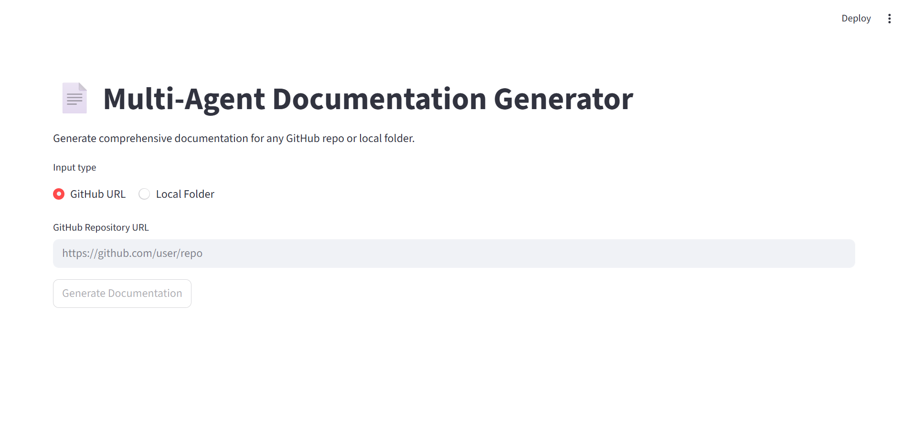
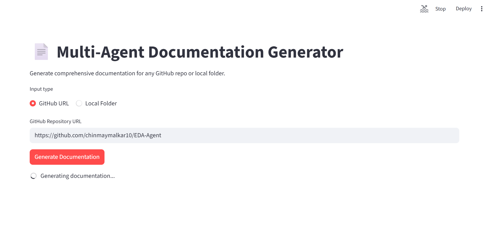
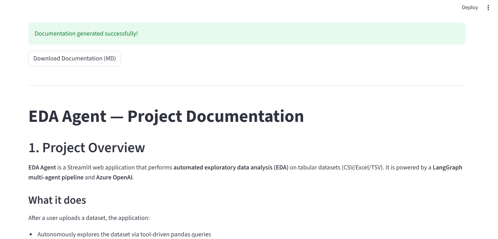

# AutoDocGen-Agent

> **Multi-agent documentation generator powered by LangGraph and Azure OpenAI.**

Point it at any GitHub repo or local folder and get comprehensive project documentation in Markdown — architecture, setup instructions, API reference, dependencies, and more.

---

<!-- TODO: Add screenshot of the app homepage -->


---

## Features

- **GitHub or local** — paste a repo URL or point to a local folder
- **Multi-agent pipeline** — 4 specialized agents analyze and document your codebase
- **Smart routing** — large repos (>50K lines) automatically use chunked analysis to stay fast
- **Parallel file analysis** — concurrent LLM calls for file summarization
- **Shallow cloning** — GitHub repos are cloned with `depth=1` for speed
- **One-click download** — export the generated documentation as a `.md` file

---

## Pipeline Architecture

```
📂 GitHub URL / Local Folder
    |
    v
🔎 Repo Analyzer         — Scans file structure, detects languages & frameworks,
                            finds existing docs, counts lines of code. (No LLM)
    |
    v
📖 Code Reader            — Summarizes entry points, config files, and key modules
                            via LLM. Routes to full or chunked mode based on repo size.
    |
    v
📦 Dependency Analyzer    — Parses package files (requirements.txt, package.json, etc.)
                            and categorizes dependencies via LLM.
    |
    v
📝 Doc Generator          — Synthesizes all analysis into structured Markdown
                            documentation with 8 sections.
```

---

## Demo

<!-- TODO: Add screenshots and update paths -->




---

## Getting Started

### Prerequisites

- Python **3.10+**
- An **Azure OpenAI** account with a deployed model (e.g. `gpt-4o`, `gpt-5.2`)
- Git (required for cloning GitHub repos)

---

### Installation

```bash
# 1. Clone the repository
git clone https://github.com/chinmaymalkar10/AutoDocGen-Agent.git
cd autodocgen

# 2. Create and activate a virtual environment
python -m venv venv
source venv/bin/activate        # macOS / Linux
venv\Scripts\activate           # Windows

# 3. Install dependencies
pip install -r requirements.txt
```

---

### Configuration

Create a `.env` file in the project root (same folder as `app.py`):

```env
AZURE_OPENAI_API_KEY=your_api_key_here
ENDPOINT=your_azure_openai_endpoint
API_VERSION=2025-04-01-preview
MODEL=your_model_name
```

| Variable | Description |
|---|---|
| `AZURE_OPENAI_API_KEY` | Your Azure OpenAI API key |
| `ENDPOINT` | Your Azure OpenAI endpoint URL |
| `API_VERSION` | API version (must support `max_completion_tokens`) |
| `MODEL` | Deployment name of your model |

> **Important:** Never commit `.env` to version control — add it to `.gitignore`.

---

### Running the App

```bash
streamlit run app.py
```

The app will open in your browser at `http://localhost:8501`.

---

## Generated Documentation Sections

The output Markdown includes:

1. **Project Overview** — what the project does and its purpose
2. **Architecture** — high-level structure and component interactions
3. **Setup & Installation** — prerequisites, steps, environment variables
4. **Configuration** — config files and their options
5. **API Reference** — key modules, classes, and functions
6. **Usage Examples** — how to run and use the project
7. **Dependencies** — production and dev dependencies with explanations
8. **Project Structure** — annotated file tree

---

## Project Structure

```
autodocgen/
|
├── app.py                          # Streamlit UI
├── graph.py                        # LangGraph graph definition & routing
├── state.py                        # TypedDict state schema
├── config.py                       # Environment config & constants
├── requirements.txt                # Python dependencies
├── .env                            # Azure OpenAI credentials (create this)
|
├── agents/
│   ├── repo_analyzer.py            # Scans repo structure (no LLM)
│   ├── code_reader.py              # Summarizes key files via LLM
│   ├── dependency_analyzer.py      # Parses & categorizes dependencies
│   └── doc_generator.py            # Generates final Markdown documentation
|
├── utils/
│   ├── llm.py                      # Azure OpenAI client & call helper
│   ├── repo_loader.py              # GitHub cloning & local path validation
│   ├── file_utils.py               # File walking, language detection, tree building
│   └── logger.py                   # JSONL structured logging
|
├── logs.jsonl                      # Token usage logs (auto-generated)
└── errors.jsonl                    # Error logs (auto-generated)
```

---

## Logging

All logging is structured JSON.

| File | Contents |
|---|---|
| `logs.jsonl` | LLM call token usage — input, output, and total tokens per call |
| `errors.jsonl` | Exceptions with timestamp, context, type, message, and traceback |

Logs are cleared automatically at the start of each new generation request.

---

## Tech Stack

| Component | Library |
|---|---|
| Agent orchestration | [LangGraph](https://github.com/langchain-ai/langgraph) |
| LLM client | [Azure OpenAI](https://learn.microsoft.com/en-us/azure/ai-services/openai/) via `openai` SDK |
| UI | [Streamlit](https://streamlit.io/) |
| Git operations | [GitPython](https://github.com/gitpython-developers/GitPython) |
| Environment config | [python-dotenv](https://github.com/theskumar/python-dotenv) |

---
